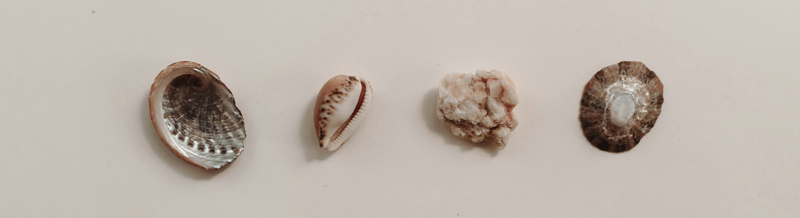
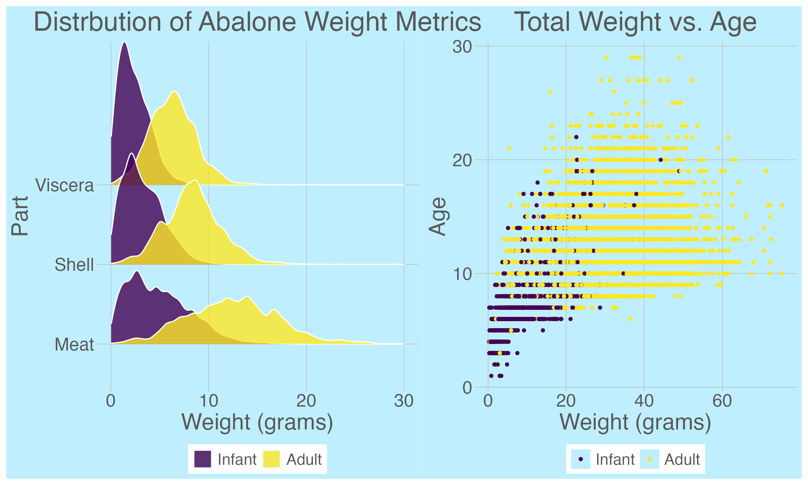
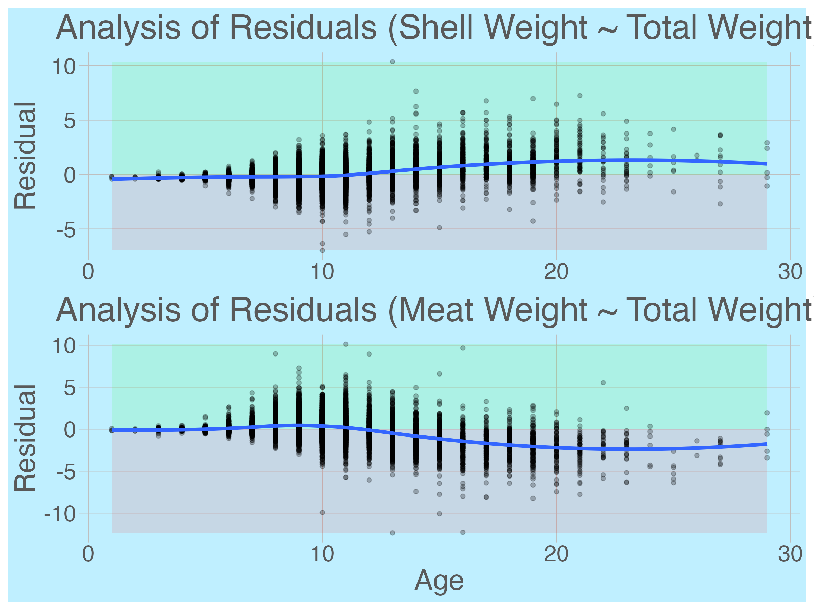

# We're Baloney About Abalone

## Executive Summary

The UCI Abalone Dataset was used to develop a set of deliverables that demonstrate a range of data science skills. These include an exploratory data analysis, an R Shiny application that allows users to explore the relationship between age and other features, and an abalone-focused retrieval-augmented generation (RAG) application.

## RAG
<iframe
  src="https://LoneWolfgang-Abalone-RAG-Demo.hf.space"
  width="100%"
  height="700"
  style="border:none;"
></iframe>

The RAG application uses methodology that is cutting edge in 2025. This repository includes a [notebook](https://github.com/Lone-Wolfgang/abalone-rag/blob/main/build_abalone_RAG_app.ipynb) that documents how the application was developed. We hope it will be useful for anyone that wants to learn more about RAG.

## RShiny

<iframe
  src="https://harvey-luna.shinyapps.io/Rshiney/"
  width="100%"
  height="600"
  style="border:none;"
></iframe>

This application allows the user to explore how different features are distributed.

## Canva Presentation

  <iframe loading="lazy" style="position: absolute; width: 100%; height: 100%; top: 0; left: 0; border: none; padding: 0;margin: 0;"
    src="https://www.canva.com/design/DAG5velASZo/NekaEfkPdsDFgpJ7YSZRkw/view?embed" allowfullscreen="allowfullscreen" allow="fullscreen">
  </iframe>

<a href="https:&#x2F;&#x2F;www.canva.com&#x2F;design&#x2F;DAG5velASZo&#x2F;NekaEfkPdsDFgpJ7YSZRkw&#x2F;view?utm_content=DAG5velASZo&amp;utm_campaign=designshare&amp;utm_medium=embeds&amp;utm_source=link" target="_blank" rel="noopener">Abalone Case Study</a> by CORE Admin

Harvey and I present our findings.

## EDA and Model Development

An exploratory data analysis was conducted in using R. You can see the full outcomes [here]

**Model Performance**

| Metric | Value |
|--------|-------|
| MAE    | **1.35** |
| MAPE   | **12.74%** |
| RMSE   | **2.02** |
| R²     | **0.62** |

